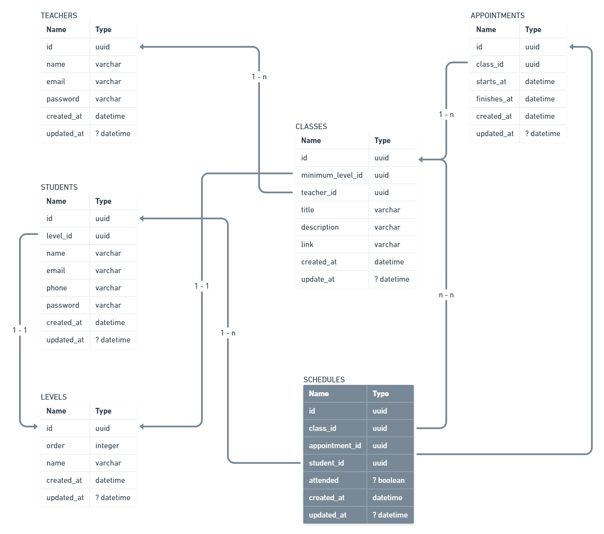

# classes-scheduler-graphql
This is a personal project for student scheduling, with classes according his course level.
I intend to make just the backend, but I'm opened to work together with whoever wants to create the frontend part. 

## How to run 🏃
- Just run using `docker-compose`
```sh
  docker-compose -f docker-compose.dev.yml up -d --build
```

- Manually
```sh
  yarn start:dev
```

- Running tests
```sh
  yarn test
```

## Endpoints API 📡
```md
  Base URL and Playground: http://localhost:3333/graphql
```

## Tools :toolbox:
  
  
  
  
  

## Database schema :camera:


## Requirements :construction_worker:

<details>
  <summary><b>Functional requirements</b></summary>

  | N° | Name | OK |
  |----|-----------------------------------|----|
  | 01 | A Teacher can create many classes | ✅ |
  | 02 | A Teacher can create many appointments to the classes | ✅ |
  | 03 | A Teacher cannot create more than one appointment at the same period (day and time) and same responsible | ✅ |
  | 04 | A Teacher can see all appointments he made in a day | ✅ |
  | 05 | A Teacher can see all appointments he made by a period of time | ✅ |
  | 06 | A Teacher can check if the Student attended the schedule | |
  | 07 | A Teacher can update the Student level to any other higher | |
  | 08 | A Student can schedule many classes (appointments) | |
  | 09 | A Student cannot schedule more than one class (appointments) at the same period (day and time) | |
  | 10 | A Student can schedule a class only if he has the minimum required level to participate | |
  | 11 | A Student can view all the classes (appointments) where his level is lower than or equal class levels | |
  | 12 | A Teacher must provide a valid responsible to create an appointment | |
</details>

<details>
  <summary><b>Non-Functional requirements</b></summary>

  | FR N° | N° | Name | OK |
  |-------|----|----------------------------------|----|
  |  01   | 01 | A Teacher must select a valid level to create a class | ✅ |
  |  02   | 02 | An Appointment must have an start and finish times | ✅ |
  |  02   | 03 | The start time must be before than the finish one | ✅ |
  |  02   | 03 | A Teacher must select a valid class to create an appointment to it  | ✅ |
  |  02   | 04 | An Appointment can be created only by a Teacher | |
  |  03   | 05 | A message must be shown saying that the period was already chosen | ✅ |
  |  03   | 06 | A new time can be suggested when the Teacher choose an used period | |
  |  04   | 07 | A date in american format (year-month-day) must be passed | ✅ |
  |  05   | 08 | A initial and final dates in american format (year-month-day) must be passed and return grouped by day | |
  |  09   | 09 | A message must be shown saying that the Student cannot select two classes at the same period and which was chosen before | |
  |  12   | 10 | A responsible can be the teacher itself or another one | |
  |  05   | 11 | The period of time cannot be greater than 30 days | ✅ |
</details>

## To the future :rocket:
  - Add authentication and authorization;
  - See the available classes and how many people are in the appointment in real-time.
